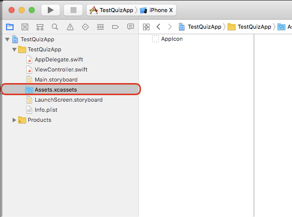
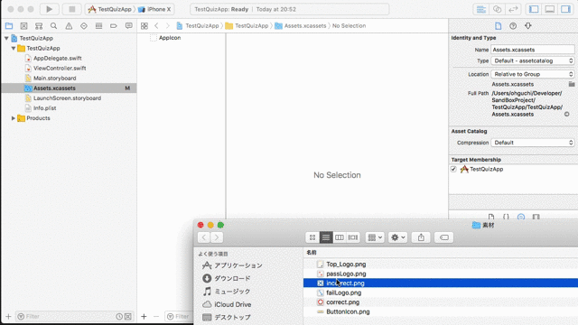
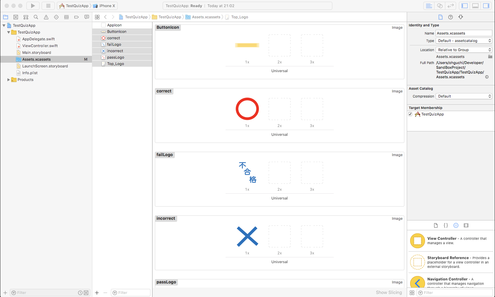
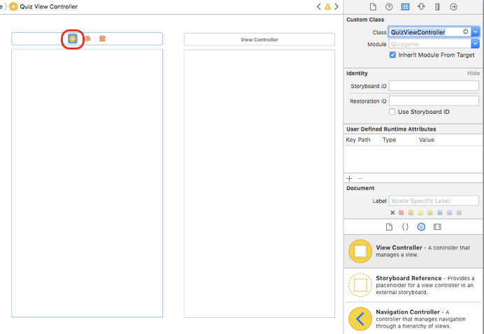
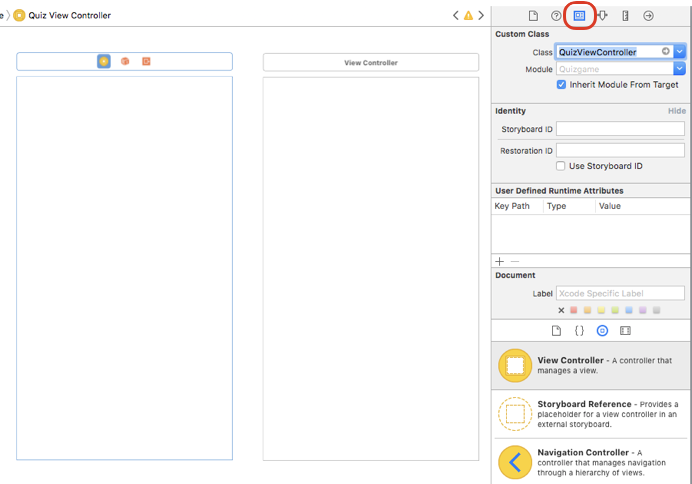
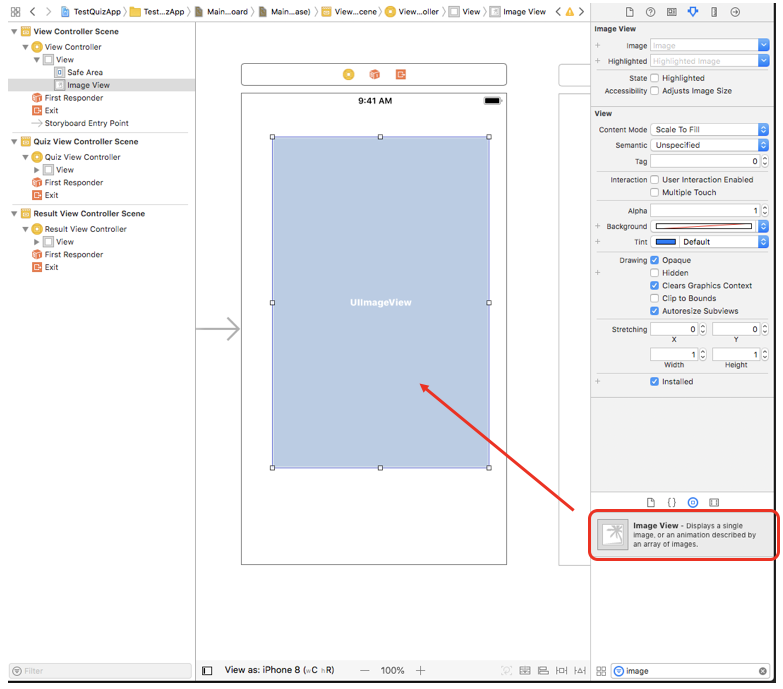
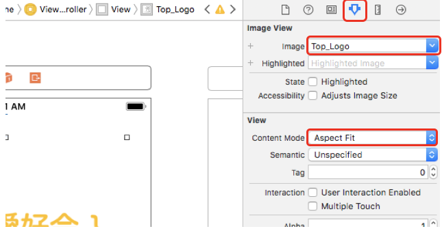
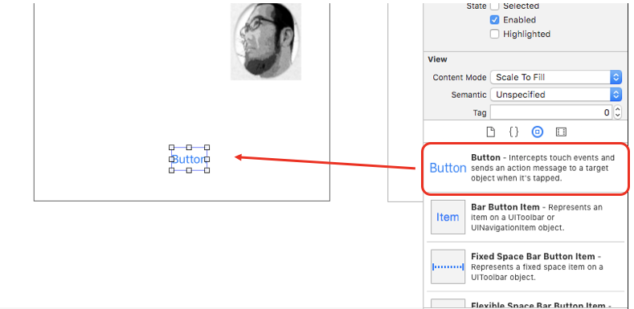
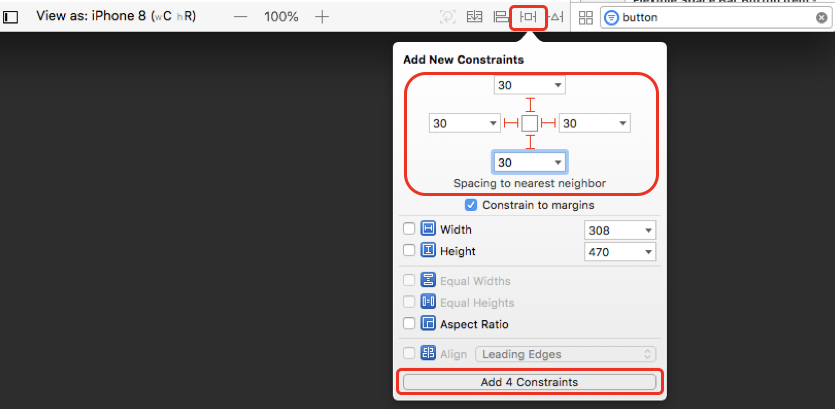
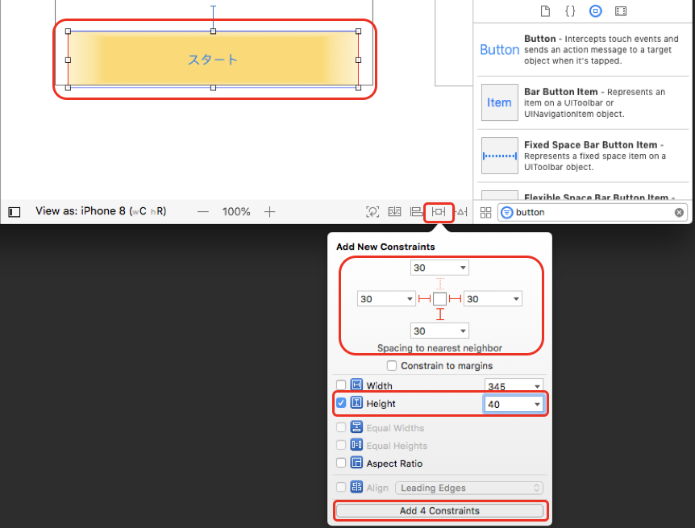

# クイズアプリの StoryBoard の設定

## StoryBoard への素材の取り込みと配置

- StoryBoard に配置した結果は以下となる。

## プロジェクトを新たに新規作成する

- Xcode のアプリを選択した状態にして、File → New → Project と選択する。

- アプリのタイプを選択する。Single View App → Next を選択する。

- プロジェクトの設定を記入する。Product Name、Organization identifier を設定し、Use Core Data、include Unit Tests、include UI Tests のチェックを外す。

- 保管場所を選択する。Source Control のチェックは付けておいてOK。

## 素材の取り込み

- ダウンロードした素材を取り込む。Assets.xcassets を選択する。

- ダウンロードしたフォルダからドラッグ＆ドロップをして素材を取り込む。

- 以下のようになる。

## ViewController を配置する

- Xcode上で、左のツリーから、Storyboard を選択する。

- Xcode の右下にある画面の画面で、「show the object library」を選択する。

- StoryBoard上にドラッグ&ドロップをして、2つ追加して並べる。

- 以下の画面のように配置する。

## 各画面用のプログラムコードを準備する

- File → New → File を選択する。

- Cocoa Touch Class を選択する。

- クラスを QuizViewController と指定する。

- 「Create」を選択する。

- 同様に、再度、File → New → File を選択する。

- Cocoa Touch Class を選択する。

- クラスを ResultViewController と指定する。

- 「Create」を選択する。

## ViewContoller にコードを割り当てる。

- Xcode上で、左のツリーから、Storyboard を選択する。

- 真ん中に並べた ViewController を選択する。

- Show the indentify inspector を選択する。

- Custom Class の項目に、QuizViewController と入れる。

- 右側に置いた ViewController を選択する。

- Show the indentify inspector を選択する

- Custom Class の項目に、ResultViewController と入れる。

## タイトル画面の作成

- 画面は以下のように設計されている

- ImageView を配置する。右下の object library から、ImageView を選択して配置する。

- ImageView の表示内容を設定する。右上の Attribute inspector を選択し、Image を Top_Logo と設定し、Content Mode を Aspect Fit とする。

- Button を配置する。右下の object library から、Button を選択して配置する。

- Button の文字列を「スタート」と設定する。

- Button の表示内容を設定する。右上の Attribute inspector を選択し、Background を ButtonIcon と設定する。 

- ImageView の制約を設定する。ImageView を選択する。

- Add new constraints を選択し、上下左右の制約に、30の値を入れ、Add 4 Constraints を選択する。

- Button の制約を設定する。「スタート」を選択し、Add new constraints を選択し、下左右の制約に、30の値を入れ、高さに、40 を指定し、、Add 4 Constraints を選択する。

- Xcode の上の方で、「▶」を押して、iPhoneX のシミュレーターを起動して表示を確認する

## ゲーム画面の作成

- 画面は以下のように設計されている

- クイズ表示等の素材を配置する

- 制約を設定する

- IBOutlet を接続する

- IBAction を設定する

- 正解不正解の表示を重ねて設定する

- IBOutlet を接続する

- 矢印の位置を変更する

- Xcode の上の方で、iPhoneX のシミュレーターを起動して確認する

## 結果表示画面の作成

- 画面は以下のように設計されている

- クイズ表示等の素材を配置する

- 制約を設定する

- IBOutlet を接続する

- 矢印の位置を変更する

- Xcode の上の方で、iPhoneX のシミュレーターを起動して確認する

## Segue の設定をする

- タイトル画面からクイズ画面への遷移の設定

- クイズ画面から結果表示画面への遷移の設定

- 結果表示画面からタイトル画面への遷移の設定

